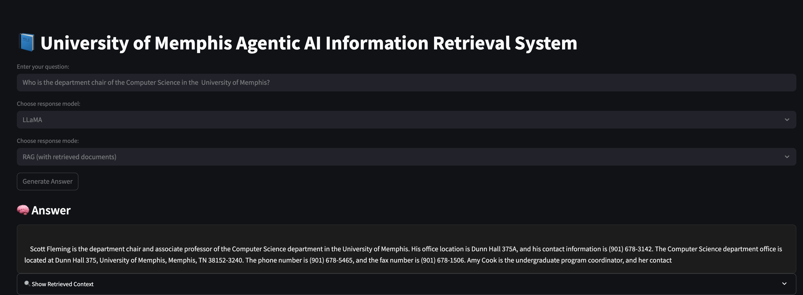

# 🧠 Agentic University QA System with RAG + LLMs

This project is an **interactive information retrieval system** that uses **Retrieval-Augmented Generation (RAG)** and **instruction-tuned large language models** (LLaMA 3.1 and Mistral) to answer queries based on web-scraped content from the University of Memphis website.

Built with **Streamlit**, it enables real-time question answering with semantic search, customizable model selection, and transparent context display.

---

## 🔧 Features

- ✅ User-selectable LLMs: `LLaMA 3.1` or `Mistral-7B-Instruct`
- ✅ Choose between **RAG mode** (retrieves and grounds responses) or **No-RAG mode**
- ✅ Semantic search with `SentenceTransformers` and `FAISS`
- ✅ Clean dark-mode answer formatting with context expanders
- ✅ Scrapes real-time content from university domains

---

## 📸 Demo

